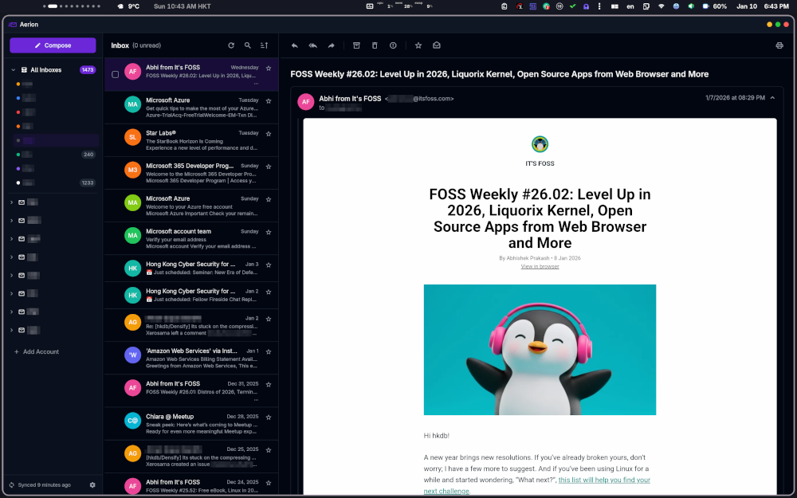

# aulycMail - A Lightweight E-Mail Client

Maintained by: @aulyc



## Summary

aulycMail is a standalone desktop e-mail client focused on:

- Resource efficiency
- Clean desktop UX
- IMAP/SMTP mail support
- Local contacts and autocomplete
- Local-first mail storage and search
- macOS desktop distribution

## OS Support

This checkout targets the macOS desktop build.

## Build

```bash
make build
make check
make ci
```

`version.json` is the single version source. Local builds include the source
commit in the runtime version and do not allocate a public build number. See
[Versioning Policy](docs/VERSIONING.md).

## Releases

Internal ad-hoc signed test release:

```bash
make release-test
```

Developer ID signed and Apple-notarized formal release:

```bash
make release-formal \
  SIGN_IDENTITY="Developer ID Application: nan ma (M9M7M2ARFD)" \
  NOTARY_PROFILE=aulyc-notary
```

Both commands require functional changes to be committed, then automatically
select the SemVer version, increment the build, create the release commit, run
a same-configuration production candidate, create the immutable tag, build the
final DMG from a temporary detached worktree at that exact tag, install it, and
verify its identity. See the complete
[Release Process](docs/RELEASE.md).

See [Development Guide](docs/DEVELOPMENT.md) for architecture, generated files,
quality gates, and the CI-neutral command entrypoint.

## Product Links

- Website: https://aulyc.com/aulycmail
- Privacy Policy: https://aulyc.com/aulycmail/privacy
- Terms of Use: https://aulyc.com/aulycmail/terms
